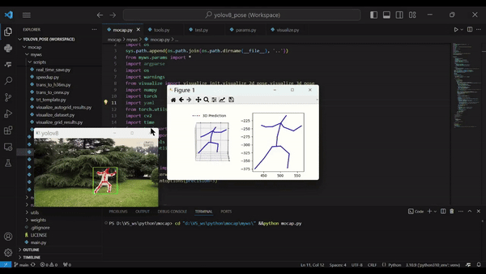

# Motion Capture From Monocular Camera

This project aims to capture 3D skeletal keypoints from a monocular camera. It combines several components to achieve this functionality. Only for personal learning purposes.

### Demo

### Workflow

1. **YOLOv8** is used to detect 2D keypoints from input images or video.
2. The **GridConv neural network** is employed to lift 2D keypoints into 3D keypoints.
3. The resulting 3D keypoints are saved into a `.pkl` file.
4. A **Blender add-on** script is planned to read the `.pkl` file and generate character animations (this feature is still under development).

### Usage

`pip install -r requirements.txt`

Modify paths in 'myws/params.py'
`python myws/mocap.py`

### Credits and Acknowledgments

This project mainly integrates existing works. The core components can be found in the following repositories:

- [GridConv](https://github.com/OSVAI/GridConv)
- [jahongir7174's YOLOv8-Pose implementation](https://github.com/jahongir7174/YOLOv8-pose)

If you find this repository helpful, please consider exploring and citing their original work.
